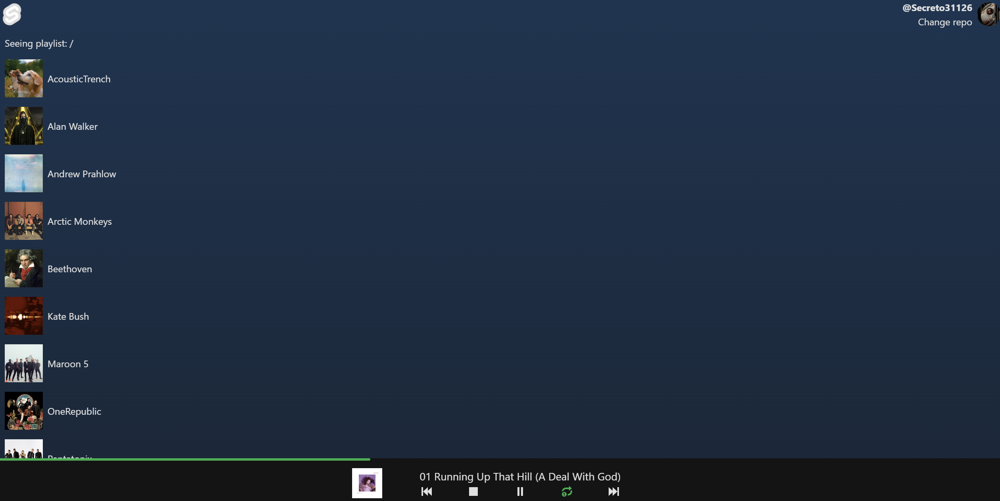

# GitHub Music

Listen to your favorite music stored in a public or private GitHub Repository with this simple web app.

## How to use

Visit [https://github-music.vercel.app](https://github-music.vercel.app), go through the most amazing landing page you will ever see, log in with your GitHub account, pick the repo where you have your audio files and you are good to go!

### Supported files

1. Audios:
   - wav
   - mp3
   - mp4
   - adts
   - ogg
   - webm
   - flac
   - [Symbolic links to supported audio files](#symlinks)

2. Images:
   - jpg
   - jpeg
   - png
   - gif
   - webp

### How to include images

The app will look for images within the folder contents. Songs will pick the images at same level, while symlinks will search in their origins.

### Symlinks

Symlinks have an interesting behavior. All _valid_ symlinks will work as expected. However, due to GitHub's API interpretation of "valid symlink to file", performance will be heavily affected. Hence the support for _invalid_ symlinks.

- Valid symlinks are those that point to a file that exists in the repository and have a relative path to it.
- Invalid symlinks are those that point to a file that **does** exist in the repository, but have an absolute path to it (aka, starts with "/"), where root is the root of the repository.

Although invalid symlinks won't work in a local environment, they will work in GitHub Music.

It's up to you to decide if you want compatibility or performance.

### Small UX things that will change

- To navigate a folder up, you need to press the "Seeing playlist: [name]" text. This will be replaced with a nicer UI in the future.

### Shortcuts

- `Space`: Play/pause
- `Ctrl` + `Space`: Stop playing
- `Arrow Right`: Foward 10 seconds
- `Ctrl` + `Arrow Right`: Next track
- `Arrow Left`: Backward 10 seconds
- `Ctrl` + `Arrow Left`: Previous track
- `L`: Toggle loop

## Attribution

Most of the icons are from [Twemoji](https://twemoji.twitter.com/), which is licensed under CC-BY 4.0.

The code is written in [SvelteKit](https://kit.svelte.dev/) and [Tailwind](https://tailwindcss.com/), both under [MIT license](LICENSE.md).
